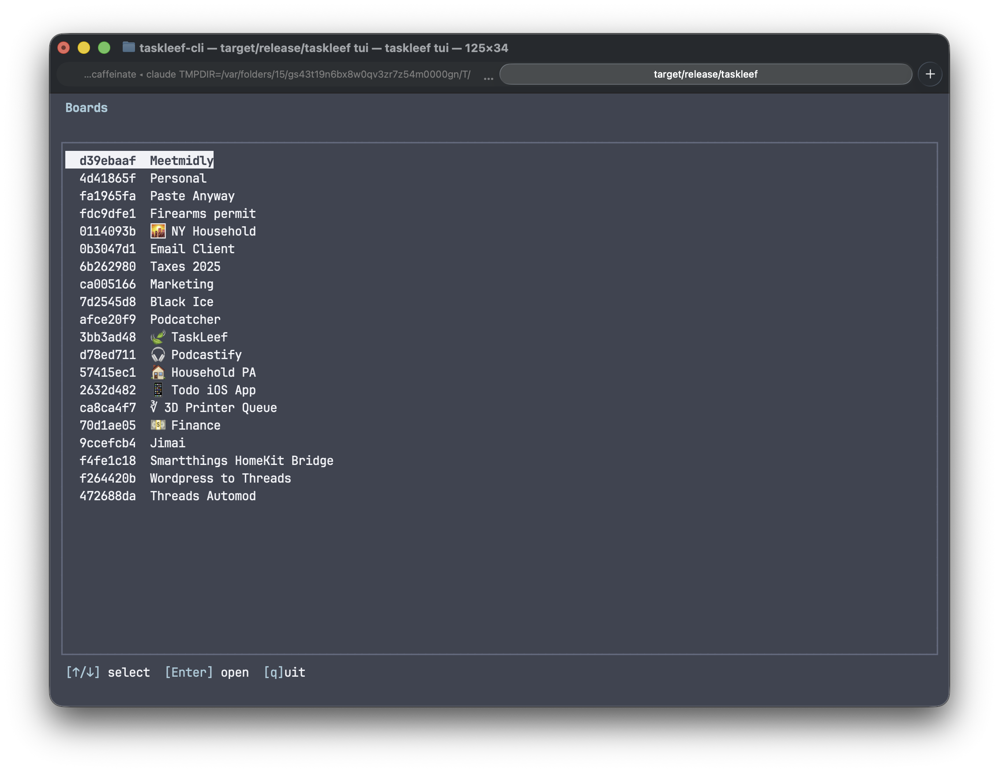
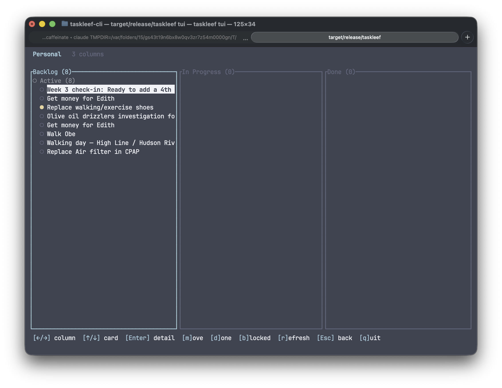

# Taskleef CLI

A command-line interface for managing todos with the [Taskleef](https://taskleef.com) todo app.

## Prerequisites

- Rust toolchain (for building from source)

## Installation

```bash
git clone https://github.com/Xatter/taskleef.git
cd taskleef
cargo build --release
```

The binary will be at `target/release/taskleef`. Copy it to your PATH:
```bash
cp target/release/taskleef /usr/local/bin/
```

## Configuration

### Option 1: Environment Variable

1. Go to [taskleef.com](https://taskleef.com) and generate an API key
2. Set the `TASKLEEF_API_KEY` environment variable:

```bash
export TASKLEEF_API_KEY=your-api-key-here
```

Add this to your `~/.bashrc` or `~/.zshrc` to make it permanent.

### Option 2: Auth File

Create an auth file (e.g., `~/.taskleef.auth`) containing:
```bash
TASKLEEF_API_KEY=your-api-key-here
```

Then use the `--auth-file` flag:
```bash
taskleef --auth-file ~/.taskleef.auth list
taskleef -a ~/.taskleef.auth list
```

This is useful for managing multiple accounts or keeping credentials separate.

### Optional: Custom API URL

If you're running your own Taskleef server, set:
```bash
export TASKLEEF_API_URL=https://your-server.com
```

### Optional: Command Alias

If you prefer using `tl` instead of `taskleef`, add this alias to your `~/.bashrc` or `~/.zshrc`:
```bash
alias tl=taskleef
```

## Tab Completion

### Bash
```bash
source /path/to/taskleef/taskleef-completion.bash
```

### Zsh
```bash
source /path/to/taskleef/taskleef-completion.zsh
```

Add the appropriate line to your `~/.bashrc` or `~/.zshrc` to enable completion on startup.

## MCP Server (AI Integration)

Taskleef provides a [Model Context Protocol](https://modelcontextprotocol.io/) server, allowing AI assistants like Claude Code and Claude Desktop to manage your todos, boards, and Kanban workflows directly.

### Claude Code

```bash
claude mcp add --transport http taskleef https://taskleef.com/mcp/messages -H "X-API-Key: YOUR_API_KEY"
```

Then restart Claude Code and verify with `claude mcp list`.

### Manual Configuration

Add to `~/.claude.json`:

```json
{
  "mcpServers": {
    "taskleef": {
      "type": "http",
      "url": "https://taskleef.com/mcp/messages",
      "headers": {
        "X-API-Key": "your-api-key-here"
      }
    }
  }
}
```

### Claude Desktop

Add to your MCP settings file:

```json
{
  "mcpServers": {
    "taskleef": {
      "transport": {
        "type": "sse",
        "url": "https://taskleef.com/mcp/sse",
        "headers": {
          "X-API-Key": "your-api-key-here"
        }
      }
    }
  }
}
```

See the [full API documentation](https://taskleef.com/docs) for all 39 available tools across todos, boards, columns, cards, members, tags, and comments.

## Usage

### Global Options

```bash
taskleef [--auth-file <path>] <command> [args]
taskleef [-a <path>] <command> [args]
```

### Basic Commands

```bash
# List pending todos
taskleef list
taskleef ls

# List all todos (including completed)
taskleef list -a

# Add a new todo
taskleef add "Buy groceries"

# Quick add (without 'add' keyword)
taskleef "Buy groceries"

# Show a todo with details and subtasks
taskleef show <title-or-id>

# Mark a todo as complete
taskleef complete <title-or-id>
taskleef done <title-or-id>

# Delete a todo
taskleef delete <title-or-id>
taskleef rm <title-or-id>
```

### Inbox

```bash
# List todos not assigned to any project
taskleef inbox
```

### Subtasks

```bash
# Add a subtask to a todo
taskleef subtask <parent-title-or-id> "Subtask title"
```

### Projects

```bash
# List all projects
taskleef project list

# Create a new project
taskleef project add "Project Name"

# Show project with its todos
taskleef project show <project-name-or-id>

# Delete a project
taskleef project delete <project-name-or-id>

# Add a todo to a project
taskleef project add-todo <project-name-or-id> <todo-title-or-id>

# Remove a todo from a project
taskleef project remove-todo <project-name-or-id> <todo-title-or-id>
```

### Boards (Kanban)

```bash
# Show default board (ASCII view)
taskleef board

# List all accessible boards
taskleef board list

# Show a specific board with columns and cards
taskleef board show <board-name-or-id>

# List cards in a specific column
taskleef board column <column-name-or-id>

# Move a card to a different column
taskleef board move <card-title-or-id> <column-name-or-id>

# Mark a card as done in its current column
taskleef board done <card-title-or-id>

# Assign a card to the current user
taskleef board assign <card-title-or-id>

# Delete all cards in a column
taskleef board clear <column-name-or-id>
```

### Interactive TUI

Launch a full-screen terminal UI with an interactive kanban board.





```bash
# Open the TUI (starts with board picker)
taskleef tui
taskleef t
```

**Board picker**: `↑/↓` to select, `Enter` to open, `q` to quit.

**Kanban board**:
| Key | Action |
|-----|--------|
| `←/→` or `h/l` | Navigate columns |
| `↑/↓` or `j/k` | Navigate cards |
| `Enter` | Open card detail (animated) |
| `m` | Move card to another column |
| `d` | Mark card as done |
| `b` | Mark card as blocked |
| `i` | Mark card as active (inbox) |
| `r` | Refresh board data |
| `Esc` | Back to board list |
| `q` | Quit |

Cards are grouped by status within each column (Active, Blocked, Done) and all are navigable.

## Finding todos, projects, and boards

Commands that accept an identifier support:

- **ID prefix**: The first few characters of the UUID (e.g., `abc12`)
- **Title match**: Partial, case-insensitive title match (e.g., `groceries` matches "Buy groceries")

## Examples

```bash
# Add a todo
$ taskleef add "Review pull request"
Created: Review pull request (a1b2c)

# List todos
$ taskleef ls
Pending todos:

  ○ a1b2c  Review pull request
  ● d3e4f  2024-01-15  Fix login bug

# Complete a todo by title
$ taskleef done "pull request"
Completed: Review pull request

# Create a project and add todos
$ taskleef project add "Website Redesign"
Created project: Website Redesign (x7y8z)

$ taskleef project add-todo "Website" "Fix login"
Added todo to project: Website Redesign

# View a kanban board
$ taskleef board
┌─────────────┬─────────────┬─────────────┐
│ Backlog     │ In Progress │ Done        │
├─────────────┼─────────────┼─────────────┤
│ ○ Fix bug   │ ● Feature A │ ✓ Setup CI  │
│ ○ Add tests │             │             │
└─────────────┴─────────────┴─────────────┘

# Move a card to a different column
$ taskleef board move "Feature A" "Done"
Moved: Feature A -> Done
```

## Priority Indicators

- ○ No priority
- ● (green) Low priority
- ● (yellow) Medium priority
- ● (red) High priority

## License

MIT
